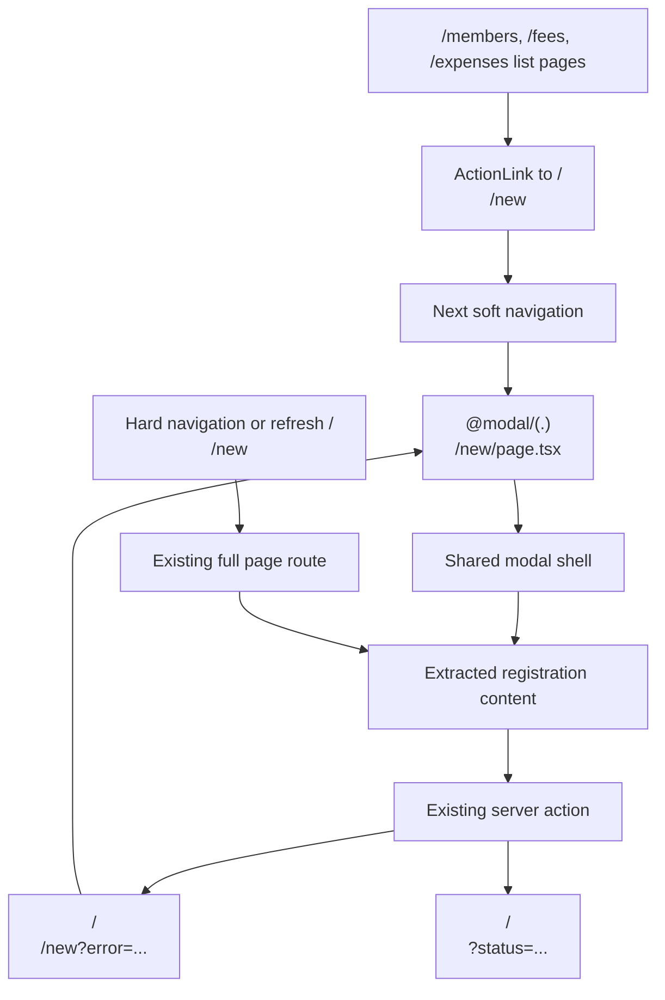

# Registration Modals - Plan

## Goal Capsule

| Field | Decision |
|---|---|
| Objective | Replace page-transition registration actions with modals for every current registration action except schedule and settlement. |
| In scope | `/members` 회원 등록, `/fees` CSV 등록, and `/expenses` 지출 등록. |
| Out of scope | `/schedule` 일정 등록, `/settlements` PDF/download actions, edit flows, inline fee payment handling, and database schema changes. |
| Authority | User request first, then `AGENTS.md`, then local Next docs in `node_modules/next/dist/docs/`, then existing atomic UI conventions. |
| Stop conditions | Stop if the current Next route conventions cannot support modal interception in this app group without breaking direct `/new` page access. |

---

## Product Contract

### Summary

Operators should stay on the current management page when they click registration actions for members, fee CSV import, or expenses.
The registration form opens as a modal over the list context, while direct navigation to the existing `/new` URLs remains a full page fallback.

### Problem Frame

The current primary actions in data panel headers navigate away from the list page.
That makes quick entry feel heavier and loses the operator's visual context, especially after recent work moved page-level actions close to the data they affect.
The schedule registration flow is explicitly excluded, and settlement has no registration action in the current implementation.

### Requirements

**Modal behavior**

- R1. Clicking `회원 등록` on `/members` opens the member registration UI in a modal over the member list instead of visibly replacing the page.
- R2. Clicking `CSV 등록` on `/fees` opens the fee payment CSV import UI in a modal over the fee board instead of visibly replacing the page.
- R3. Clicking `지출 등록` on `/expenses` opens the expense registration UI in a modal over the expense list instead of visibly replacing the page.
- R4. Closing a registration modal returns the operator to the underlying list route and preserves the list route's existing query state where browser history allows it.

**Fallback and routing**

- R5. Direct hard navigation or refresh on `/members/new`, `/fees/new`, or `/expenses/new` continues to render the existing full page form experience.
- R6. Validation failures that redirect back to `/members/new`, `/fees/new`, or `/expenses/new` show the appropriate form error inside the modal during intercepted navigation.
- R7. Successful submissions continue to redirect to the relevant list page with existing status query parameters.

**Scope exclusions**

- R8. `/schedule/new` remains a normal page navigation.
- R9. Settlement actions remain unchanged because the current settlement action is PDF download, not registration.

### Acceptance Examples

- AE1. Given an operator is on `/members?status=paused&q=김`, when they click `회원 등록`, then the member form appears in a modal and the underlying member list remains visible.
- AE2. Given the member modal is open, when the operator submits an invalid phone-last-four value, then the modal shows `전화번호는 끝 4자리 숫자만 입력하세요.` without falling back to a full page.
- AE3. Given an operator opens `/expenses/new` in a new browser tab or refreshes that URL, then the full expense registration page renders.
- AE4. Given an operator is on `/schedule`, when they click `일정 등록`, then the existing `/schedule/new` page navigation still happens.

---

## Planning Contract

### Key Technical Decisions

- KTD1. Use Next parallel routes plus intercepting routes for modal routing.
  Local Next docs describe this as the route-level modal pattern because it preserves shareable URLs, browser back/forward behavior, and full page fallback on hard navigation.
- KTD2. Keep the existing `/new` pages as canonical direct routes.
  The modal should import the same form content so direct access, refresh, and validation redirects keep working without a second implementation of the forms.
- KTD3. Extract form content, not action logic.
  Current server actions already validate, revalidate, and redirect; changing them to return client state would widen the blast radius and is unnecessary for modal routing.
- KTD4. Add a shared app modal shell as an atomic-friendly component.
  Styling should use SCSS modules, existing tokens from `src/app/globals.scss`, and breakpoint variables from `src/app/_breakpoints.scss`.
- KTD5. Add modal route slots at the authenticated app layout level.
  `src/app/(app)/layout.tsx` currently accepts only `children`; it needs a `modal` parallel route prop that `AppShell` renders alongside the main content.

### High-Level Technical Design

### Implementation Constraints

- Keep SCSS class names meaningful kebab-case hyphen names.
- Do not reintroduce body-level `PageHeader`; page titles stay in the shell sub navigation.
- Do not alter schedule registration, settlement PDF download, edit links, or inline fee payment buttons.
- Read the local Next docs before implementation touches route conventions; relevant files are `node_modules/next/dist/docs/01-app/03-api-reference/03-file-conventions/parallel-routes.md`, `node_modules/next/dist/docs/01-app/03-api-reference/03-file-conventions/intercepting-routes.md`, and `node_modules/next/dist/docs/01-app/03-api-reference/03-file-conventions/default.md`.

### Sources

- `docs/PROJECT_CHECKLIST.md`
- `docs/WORK_LOG.md`
- `src/app/(app)/members/page.tsx`
- `src/app/(app)/fees/page.tsx`
- `src/app/(app)/expenses/page.tsx`
- `src/app/(app)/members/new/page.tsx`
- `src/app/(app)/fees/new/page.tsx`
- `src/app/(app)/expenses/new/page.tsx`
- `src/app/(app)/layout.tsx`
- `src/features/shell/AppShell.tsx`
- `node_modules/next/dist/docs/01-app/03-api-reference/03-file-conventions/parallel-routes.md`
- `node_modules/next/dist/docs/01-app/03-api-reference/03-file-conventions/intercepting-routes.md`
- `node_modules/next/dist/docs/01-app/03-api-reference/03-file-conventions/default.md`

---

## Implementation Units

### U1. Shared Modal Shell

- **Goal:** Add a reusable modal shell that can host server-rendered form content and close through app navigation.
- **Requirements:** R4, R6
- **Files:** `src/components/molecules` or `src/components/organisms`, `src/components/molecules/Molecules.module.scss` or `src/components/organisms/Organisms.module.scss`, related index exports and tests.
- **Approach:** Build a small client component for close behavior using `next/navigation` and render server component children inside it.
  Use accessible dialog semantics, a labelled title, an overlay, a compact close button, and tokenized SCSS.
- **Test Scenarios:** Verify the modal renders with `role="dialog"`, exposes the title as the accessible name, renders children, and calls the expected close navigation behavior.
- **Verification:** Add or update component tests near `src/components/molecules/molecules.test.tsx` or `src/components/organisms/organisms.test.tsx`.

### U2. Extract Registration Content Components

- **Goal:** Split each `/new` page into reusable form content plus a full page wrapper.
- **Requirements:** R1, R2, R3, R5, R6, R7
- **Files:** `src/app/(app)/members/new/page.tsx`, `src/app/(app)/members/new/page.test.tsx`, `src/app/(app)/fees/new/page.tsx`, `src/app/(app)/fees/new/page.test.tsx`, `src/app/(app)/expenses/new/page.tsx`, `src/app/(app)/expenses/new/page.test.tsx`, and new colocated content components if useful.
- **Approach:** Move each form panel and error-message derivation into an exported server component or helper function that accepts the resolved `searchParams`.
  Keep `FormPageTemplate` only in the full page route.
- **Test Scenarios:** Existing `/new` page tests still pass and continue to prove full page fallback rendering.
  Add focused tests for validation messages if extraction changes the tested boundaries.
- **Verification:** Run focused new page tests for members, fees, and expenses.

### U3. Add Authenticated App Modal Slot And Intercepted Routes

- **Goal:** Render the extracted registration content inside a modal when list-page links soft navigate to the existing `/new` URLs.
- **Requirements:** R1, R2, R3, R4, R5, R6
- **Files:** `src/app/(app)/layout.tsx`, `src/features/shell/AppShell.tsx`, `src/features/shell/AppShell.test.tsx`, `src/app/(app)/@modal/default.tsx`, `src/app/(app)/@modal/(.)members/new/page.tsx`, `src/app/(app)/@modal/(.)fees/new/page.tsx`, `src/app/(app)/@modal/(.)expenses/new/page.tsx`, and any catch-all null route needed to close stale modal slots.
- **Approach:** Add a `modal` prop to the authenticated layout and shell.
  Create `@modal/default.tsx` returning `null`.
  Create intercepted route pages that wrap the extracted content in the shared modal shell.
  Add a null catch-all under the modal slot if client navigation away leaves the slot active.
- **Test Scenarios:** AppShell renders normal children and modal slot content.
  Intercepted route pages render dialog titles and the correct registration form content.
  Direct `/new` pages remain full page routes through U2 tests.
- **Verification:** Run shell and intercepted route tests after adding route files.

### U4. Preserve Existing List Actions And Exclusions

- **Goal:** Keep the visible list actions in place while ensuring only the requested sections open modal routes.
- **Requirements:** R1, R2, R3, R8, R9
- **Files:** `src/app/(app)/members/page.tsx`, `src/app/(app)/members/page.test.tsx`, `src/app/(app)/fees/page.tsx`, `src/app/(app)/fees/page.test.tsx`, `src/app/(app)/expenses/page.tsx`, `src/app/(app)/expenses/page.test.tsx`, `src/app/(app)/schedule/page.tsx`, `src/app/(app)/schedule/page.test.tsx`, `src/features/events/ScheduleCalendar.test.tsx`.
- **Approach:** Keep `ActionLink href="/members/new"`, `ActionLink href="/fees/new"`, and `ActionLink href="/expenses/new"` so Next can intercept them on soft navigation.
  Do not change the schedule action link.
- **Test Scenarios:** Existing list tests still see the same hrefs for member, fee CSV, and expense actions.
  Schedule tests continue to assert `/schedule/new`.
- **Verification:** Run focused page tests for members, fees, expenses, and schedule.

### U5. Browser-Level Verification

- **Goal:** Prove the user-visible modal behavior works beyond static rendering tests.
- **Requirements:** R1, R2, R3, R4, R5, R6, R7, R8
- **Files:** Existing test setup and browser QA notes only unless the repo already has browser test files to extend.
- **Approach:** Start the dev server, authenticate with the existing local operator session if available, and manually verify soft navigation, close behavior, validation errors, direct URL fallback, successful redirect, and schedule exclusion.
- **Test Scenarios:** Open each list page, click the registration action, close the modal, submit an invalid form, submit a valid minimal record where safe, open `/expenses/new` directly, and confirm `/schedule/new` is unchanged.
- **Verification:** Record outcomes in `docs/WORK_LOG.md` if implementation proceeds and verification passes.

---

## Verification Contract

| Gate | Command | Covers | Done Signal |
|---|---|---|---|
| Component and route focused tests | `npm run test -- src/components src/features/shell src/app/\\(app\\)/members src/app/\\(app\\)/fees src/app/\\(app\\)/expenses src/app/\\(app\\)/schedule` | U1, U2, U3, U4 | Modal shell, intercepted routes, full page fallbacks, list links, and schedule exclusion pass. |
| Full test suite | `npm run test` | U1-U5 | No regression in existing model, action, page, and PDF tests. |
| Lint | `npm run lint` | U1-U4 | SCSS/TSX style and Next conventions pass. |
| Typecheck | `npx tsc --noEmit` | U1-U4 | Parallel route props and component exports typecheck. |
| Build | `npm run build` | U1-U5 | Next route conventions compile, including `@modal/default.tsx`. |
| Browser verification | local dev server | U5 | Member, fee CSV, and expense registration open as modals; schedule remains a page. |

---

## Definition of Done

- The member, fee CSV, and expense registration actions open modals during list-page soft navigation.
- `/members/new`, `/fees/new`, and `/expenses/new` remain usable full page routes on hard navigation and refresh.
- Validation redirects for the three registration routes render the error state in the modal when opened from the list context.
- Successful submissions retain existing redirects and revalidation behavior.
- `/schedule/new` and settlement actions are unchanged.
- Shared modal styles use SCSS modules, existing tokens, and meaningful kebab-case class names.
- Focused tests, full tests, lint, typecheck, and build pass.
- Browser verification confirms the modal behavior and the schedule exclusion.
