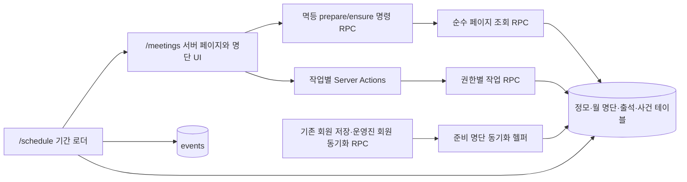
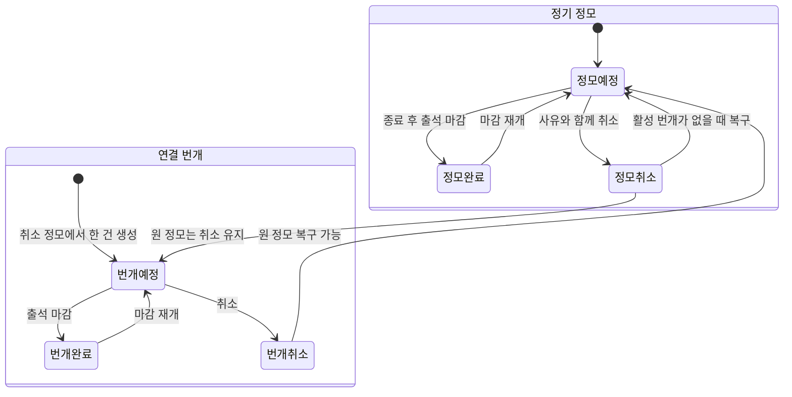
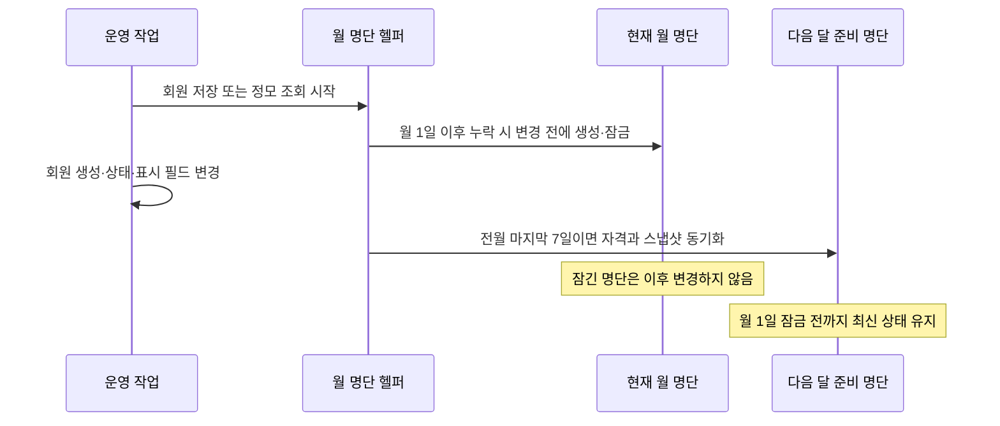
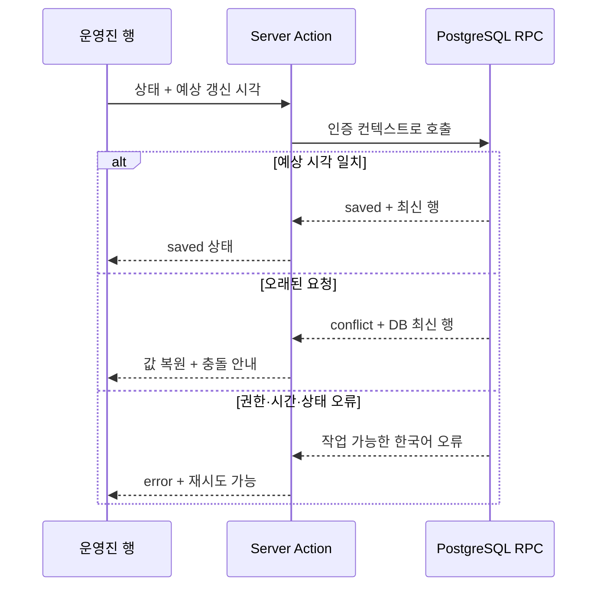

# 정모 참석 및 출석 관리 구현 계획

## Goal Capsule

월 2회 정기 정모의 월별 대상 명단, 사전 응답, 실제 출석, 취소·복구·대체 번개를 운영진이 `/meetings`에서 관리하고 기존 `/schedule`에서도 중복 저장 없이 확인할 수 있게 한다.

- 제품 계약의 최우선 원본은 [정모 참석 및 출석 관리 설계](../specs/2026-07-13-club-meeting-attendance-design.md)다.
- 데이터 변경은 권한을 재검증하는 작업별 PostgreSQL RPC에서만 수행하고, 화면과 Server Action은 이 경계를 호출한다.
- 구현은 테스트 우선으로 진행하며 각 단위가 지정한 집중 테스트를 통과한 뒤 다음 단위로 넘어간다.
- 구현자는 아래 U-ID를 의존 순서대로 수행하고 진행 상태는 계획 문서 밖에서 관리한다.
- 최초 배포 월을 통계 적격으로 바꾸거나, 한 원 정모에 두 번째 번개를 허용하거나, 일반 회원 직접 응답을 추가해야 한다면 제품 범위 변경이므로 멈추고 설계를 다시 확인한다.
- 마이그레이션을 실제 Supabase 프로젝트에 적용할 권한이나 인증 브라우저 검증 환경이 없으면 코드·정적 검증까지 진행한 뒤 그 지점을 명확한 운영 차단점으로 남긴다.

## Product Contract

### Problem Frame

현재 시스템은 일반 일정만 관리하고 정모 대상 명단, 사전 참석 의사, 당일 출석, 취소와 대체 번개의 관계를 보존하는 도메인이 없다. 단순 일정 행에 상태를 덧붙이면 월 1일 기준 대상자 분모와 반복되는 취소·복구 이력을 잃게 된다. 따라서 정모 회차, 월 명단, 회차별 상태, 추가 전용 사건 이력을 분리하고 운영 동작을 트랜잭션 단위로 만들어야 한다.

### Actors

- **A1 운영진:** `meetings.view`로 목록·명단·변경 이력을 조회한다.
- **A2 회차 관리자:** `meetings.manage`로 장소, 취소·복구, 번개를 관리한다. 마감·재개는 A2와 A3 권한을 모두 가진 운영진이 수행한다.
- **A3 출석 관리자:** `meetings.attendance.manage`로 임시 대상, 사전 응답, 실제 출석을 관리한다.
- 현재 `admin`과 `operator`는 세 권한을 모두 받지만 화면과 DB는 분리된 권한 조합도 정확히 처리한다.

### Requirements

- **R1 회차 자동 보장:** `Asia/Seoul` 기준 현재 월부터 다음 2개월까지 첫째·셋째 토요일 18:00~22:00 정기 정모를 중복 없이 보장한다.
- **R2 월 명단 수명주기:** 전월 마지막 7일에는 다음 달 명단을 준비하고, 월 1일 이후에는 현재 월 명단을 회원 변경 전에 잠근다. 준비 중에는 회원 자격과 회원번호·이름·그룹 스냅샷을 모두 동기화한다.
- **R3 최초 배포 월:** 월 1일 이후 처음 배포한 현재 월은 `bootstrap`, `statistics_eligible = false`로 잠그고 다음 달부터 자동 명단을 통계 적격으로 사용한다.
- **R4 회차 대상:** 월 명단 대상과 회차별 `ad_hoc` 대상을 구분한다. 임시 대상은 초기 상태에서만 제거할 수 있고 정기 통계에서는 제외한다.
- **R5 사전 응답:** 회차별로 `unanswered`, `attending`, `late`, `declined`를 독립 저장한다.
- **R6 실제 출석:** 시작 시각 이후 `unchecked`, `present`, `late`, `absent`를 저장하고 실제 `late`에는 시작 후·종료 이내 도착 시간을 요구한다.
- **R7 마감·재개:** 종료 시각 이후 마감할 때 미체크를 `close_default` 결석으로 바꾸고, 재개 시 그 자동 결석만 미체크로 복원한다.
- **R8 회차 수명주기:** 장소 변경, 취소·복구, 마감·재개, 번개 생성, 임시 대상 추가·제거를 추가 전용 이력으로 남긴다. 취소 번개는 복구하지 않고 원 정모당 번개는 평생 한 건만 허용한다.
- **R9 집계 계약:** 회차별 집계에는 모든 대상자를 포함한다. 후속 정기 출석률·지각률은 통계 적격 월 명단의 완료·비취소 정기 정모만 사용하고 `bootstrap`, `ad_hoc`, 번개를 제외한다.
- **R10 월별 운영 화면:** 월 필터, 회차 요약, 데스크톱 표, 모바일 목록, 상태·권한별 작업을 기존 앱 셸과 내부 스크롤 규칙 안에서 제공한다.
- **R11 명단 모달:** 검색 파라미터 딥링크, 사전 참석·출석 체크 탭, 행별 저장 상태, 변경 이력, 포커스 트랩·복귀, 키보드 탭 동작을 제공한다.
- **R12 일정 통합:** 일반 일정과 정모를 공통 달력 모델로 병합한다. 월간은 월 범위, 주간은 실제 7일 범위로 조회하고 정모는 `/meetings` 원본으로 연결한다. `events.view`만 가진 사용자는 기존 일반 일정만 정상 조회한다.
- **R13 권한·보안:** 화면 노출과 별개로 읽기·회차 관리·출석 관리 권한을 서버와 DB에서 재검증한다. 인증 역할의 직접 DML을 막고 RPC는 `auth.uid()`, 활성 프로필, 고정 `search_path`, 최소 실행 권한을 사용한다.
- **R14 동시성·무결성:** 응답과 실제 출석에 별도 마지막 확인 시각을 사용해 오래된 행 저장을 거부하고 최신 서버 행을 반환한다. 모든 시간 판정은 KST를 명시한다.
- **R15 오류 계약:** 부분 성공을 정상처럼 표시하지 않고 안전한 한국어 오류를 제공한다. 잘못된 회차 ID나 권한 부족은 명단 데이터를 노출하지 않는다.
- **R16 외부 응답:** 외부 채널 응답은 운영진이 전사하며 앱의 상태를 최종 원본으로 사용한다. 일반 회원 직접 응답과 알림은 범위 밖이다.

### Key Flows

- **F1 월 진입:** `/meetings` 진입 → 현재+2개월 회차 보장 → 준비/잠금 명단 처리 → 선택 월 목록·집계 반환.
- **F2 행 저장:** 명단 모달 진입 → 대상 행 수정 → 작업별 RPC 권한·시간·버전 검증 → 성공 시 서버 행 반영, 충돌 시 최신 행 복원.
- **F3 출석 종료:** 실제 출석 입력 → 종료 후 마감 → 미체크 자동 결석 → 필요 시 재개 → 자동 결석만 복원.
- **F4 취소·대체:** 원 정모 취소 → 번개 한 건 생성 → 필요 시 번개 취소 → 원 정모 복구. 모든 사건은 이력에 남는다.
- **F5 임시 대상:** 활동중 비대상 회원 추가 → 상태 입력 또는 초기 상태에서 제거 → 회차 집계 포함·정기 통계 제외.
- **F6 일정 왕복:** 일정 범위에서 일반 일정을 조회하고 `meetings.view`가 있으면 정모도 병합 → 정모 선택 → `period_month`의 명단 모달 → 검증된 `/schedule` 복귀 URL로 종료.
- **F7 권한 분기:** 권한 컨텍스트 조회 → 메뉴·버튼·읽기 전용 상태 결정 → DB RPC에서 같은 권한을 최종 판정.

### Acceptance Examples

- **AE1 월 경계:** 7월 31일 회원 상태 변경 전에 7월 명단은 잠기고, 변경 결과는 준비 중인 8월 명단에 반영된다. 8월 1일 이후 7월·8월 잠금 명단은 바뀌지 않는다.
- **AE2 최초 배포:** 7월 13일 처음 기능을 적용하면 7월은 운영 가능한 `bootstrap` 명단이지만 누적 정기 통계에서는 빠지고, 8월 자동 명단은 통계 적격이다.
- **AE3 저장 충돌:** 두 운영진이 같은 회원의 사전 응답을 같은 기준 시각으로 바꾸면 첫 저장만 성공하고 두 번째는 최신 서버 행과 충돌 메시지를 받는다. 실제 출석의 별도 버전은 영향을 받지 않는다.
- **AE4 마감·재개:** 수동 결석 1명과 미체크 2명이 있는 회차를 마감하면 결석 3명이 된다. 재개하면 수동 결석 1명은 유지되고 자동 결석 2명만 미체크로 돌아간다.
- **AE5 취소·번개:** 취소 정모에 번개를 만들면 대상 스냅샷만 복제되고 상태는 초기화된다. 활성 번개가 있으면 원 정모를 복구할 수 없고, 번개 취소 뒤 원 정모는 복구할 수 있지만 두 번째 번개는 만들 수 없다.
- **AE6 임시 대상:** 월중 가입 회원을 회차에 추가하면 회차 인원에는 포함되나 정기 통계에는 포함되지 않는다. 입력 전에는 제거할 수 있지만 응답 또는 출석 기록 뒤에는 제거할 수 없다.
- **AE7 딥링크:** 목록에서 연 모달은 같은 월 목록으로 닫히고, 일정에서 연 모달은 검증된 일정 URL로 닫히며, 직접 URL은 해당 월 목록으로 닫힌다.
- **AE8 일정 경계:** 7월 마지막 주의 주간 보기에는 8월 개최 번개가 표시되고, 클릭 URL의 `month`는 연결된 원 정모의 `period_month`를 사용한다.
- **AE9 권한:** 조회 전용 사용자는 목록·명단·이력을 읽지만 작업 버튼이 없고, 직접 Server Action 호출도 DB RPC에서 거부된다.

### Scope Boundaries

일반 회원 로그인·직접 응답, 메시지 알림, 누적 통계 화면, CSV 내보내기, 독립 번개, 정기 정모 날짜·시간 직접 수정은 구현하지 않는다. 기존 일반 일정 CRUD와 회원 명부 정책은 필요한 연동 지점만 수정하며 별도 재설계하지 않는다.

### Resolved During Planning

- 최초 배포 월은 잘못된 과거 분모를 만들지 않도록 통계 제외 `bootstrap`으로 운영한다.
- 준비 명단은 자격뿐 아니라 모든 표시 스냅샷을 동기화한다.
- 임시 대상은 응답·출석이 초기값인 경우에만 제거한다.
- 변경 이력은 별도 탭이 아니라 명단 모달의 접이식 영역에서 조회한다.
- 일정 진입은 서버가 동일 출처의 정확한 `/schedule` pathname과 허용된 검색 파라미터만 재조립한 `returnTo`를 사용한다.
- 달력 필터는 `meeting_date`, 정모 링크의 월은 `period_month`를 사용한다.
- 과거 번개가 취소됐더라도 같은 원 정모의 두 번째 번개는 허용하지 않는다.

## Planning Contract

### Execution Profile

- **형태:** 구현 가능한 코드 계획
- **깊이:** Deep — 신규 영속 모델, 권한 경계, 기존 회원 쓰기 RPC, 공유 모달, 일정 로더를 함께 바꾼다.
- **검증:** Vitest 집중 테스트 → 전체 정적·회귀 검증 → 실제 Supabase 함수 검증 → 인증 브라우저 검증.
- **PR/랜딩:** 이 계획은 커밋·PR 생성 여부를 강제하지 않는다. 저장소 관례와 실행 시 사용자 지시를 따른다.

### Key Technical Decisions

- **KTD1 단일 기능 마이그레이션 배치:** `202607130002_add_club_meetings.sql`에 새 enum·테이블·제약·권한·RLS·RPC와 기존 회원 RPC 재정의를 함께 둔다. U1-U4는 실제 적용 전 하나의 DB 배치로 완성·동결하고 정적 테스트하며, U4 직후 통합 DB gate를 통과한 파일은 다시 수정하지 않는다. 월 명단 동기화가 회원 변경과 같은 DB 트랜잭션이어야 하므로 애플리케이션 후처리로 분리하지 않는다. 기존 회원 RPC의 외부 시그니처·반환 계약은 보존하고, 장애 시 정모 동기화 재정의만 기존 정의로 되돌리는 검토된 전진 복구 SQL을 준비한다.
- **KTD2 작업별 RPC 전용 쓰기:** 범용 update RPC 대신 장소, 임시 대상, 응답, 출석, 취소, 복구, 마감, 재개, 번개 생성별 함수를 둔다. 모든 변경은 `meetings.view`와 작업별 특수 권한을 함께 요구하고, 출석 행을 일괄 변경하는 마감·재개는 회차·출석 관리 권한을 모두 요구한다. 허용 상태와 권한이 작업마다 달라 범용 함수는 검증 누락 위험이 크다.
- **KTD3 준비 명령과 순수 조회 분리:** 의도적으로 쓰기를 수행하는 멱등 `prepare/ensure` 명령 RPC를 먼저 호출하고 기존 `member-directory.ts`와 같은 순수 JSON 조회 RPC를 뒤이어 호출한다. 준비 명령은 캐시·프리패치 가능한 읽기로 취급하지 않으며 `meetings.view`를 가진 활성 운영자가 결정적 유지보수 작업을 촉발할 수 있다. 선택 회차가 잘못돼도 조회는 월 목록을 유지하고 모달만 안전한 오류로 표현한다.
- **KTD4 복합 출석 식별자와 월 불변 조건:** `meeting_attendance`는 `(meeting_id, member_id)`를 기본 식별자로 사용하고 월 명단 연결에는 `(roster_member_id, member_id)` 복합 외래 키를 둔다. DB constraint trigger가 monthly roster 행의 roster 월과 회차 `period_month` 일치를 강제한다. 관련 period month는 생성 후 변경할 수 없다. 임시 대상 때문에 단일 `roster_member_id` 식별자는 사용할 수 없다.
- **KTD5 분리된 동시성 버전:** 사전 응답과 실제 출석은 생성 시점부터 non-null인 각자의 `updated_at`을 예상값으로 받는다. 조건부 update가 예상값을 원자적으로 비교하고 성공할 때마다 반드시 더 큰 DB 생성 시각으로 바꾼다. 서로 다른 상태 영역의 병렬 저장을 막지 않으면서 같은 영역의 오래된 쓰기만 거부한다.
- **KTD6 추가 전용 도메인 사건:** 기존 범용 `audit_logs` 대신 회차 이력을 읽기 쉬운 `meeting_lifecycle_events`에 저장한다. 클라이언트 직접 쓰기를 막고 작업 RPC 트랜잭션에서만 추가한다.
- **KTD7 검색 파라미터 모달:** `/meetings?month&meeting`을 원본으로 사용하고 새 인터셉트·병렬 라우트는 만들지 않는다. 이 기능은 동일 페이지의 목록과 모달 데이터를 함께 반환해야 하며 직접 URL의 안전한 오류 상태가 핵심이다.
- **KTD8 공유 모달의 호환 확장:** `ModalDialog`에 선택적 `closeHref`, 큰 크기, Escape, 포커스 트랩·복귀를 추가하되 기존 호출부 기본 `router.back()` 동작은 유지한다. 정모 탭은 링크 내비게이션용 `Tabs.tsx`를 재사용하지 않고 dialog 전용 ARIA 탭으로 구현한다.
- **KTD9 KST 명시:** DB는 현재 시각을 `Asia/Seoul`로 변환해 날짜·시간 제한을 판단하고 앱의 오늘 키도 KST 헬퍼로 계산한다. 세션 시간대와 UTC ISO 문자열에 의존하지 않는다.
- **KTD10 일정 공통 표시 모델:** 기존 이벤트 전용 달력 preview를 `kind`, `href`, `badge`, `cancelled`, `canEdit`를 가진 공통 모델로 확장한다. 일반 일정만 수정·삭제하고 정모는 원본 명단 URL로 이동한다.
- **KTD11 일정 권한의 하위 호환:** `/schedule` 진입은 기존 `events.view`를 유지한다. `meetings.view`가 없으면 정모 쿼리를 건너뛰고 일반 일정만 보여주며, 정모 조회 권한이 있는 상태의 실제 소스 실패만 전체 로드 오류로 처리한다.
- **KTD12 월 단위 직렬화:** 회차 보장, 현재 명단 잠금, 다음 명단 동기화는 period month 기반 transaction advisory lock을 월 오름차순으로 먼저 얻고 동일한 테이블 잠금 순서를 사용한다. upsert의 중복 방지와 별개로 페이지 준비와 회원 저장의 교착·부분 seed를 막는다.

### High-Level Technical Design

아래 그림은 책임 경계와 상태 흐름을 설명하며 정확한 함수 시그니처를 강제하지 않는다.

### System-Wide Impact

- **회원 쓰기:** `save_member_with_contact`, `ensure_operator_member`, `sync_operator_member_name`이 준비 명단 동기화 헬퍼를 호출하도록 새 마이그레이션에서 외부 계약을 보존한 채 재정의된다. 잠긴 현재 월은 건드리지 않고 준비 중인 다음 달만 수정한다. authenticated의 members 직접 DML은 회수해 이 트랜잭션을 우회하지 못하게 하고 service-role 운영 작업은 별도 경계로 남긴다.
- **권한 컨텍스트:** 새 권한이 `get_current_operator_context` 결과에 포함된다. 앱 셸은 권한에 따라 정모 메뉴를 숨기고 `/meetings` 페이지는 조회 권한 없이 직접 접근하면 차단한다.
- **읽기 실패:** 페이지 준비·조회 RPC 실패는 월 화면 전체 오류다. 선택 회차만 유효하지 않거나 권한이 없으면 월 목록은 유지하고 명단 모달에 안전한 오류만 반환한다.
- **쓰기 실패:** RPC가 한 트랜잭션에서 상태와 사건을 함께 바꾼다. Server Action은 DB 결과를 제한된 DTO로 변환하고 행 저장 충돌과 도메인 오류를 구분한다.
- **캐시·갱신:** 행 저장은 반환된 행으로 로컬 상태를 확정한다. 회차 생명주기와 장소·대상 변경은 `/meetings`와 필요한 경우 `/schedule`을 재검증한다.
- **공유 UI:** `ModalDialog`의 기본 닫기 동작은 기존 회원 등록·수정 모달과 호환되어야 한다. 접근성 확장은 모든 호출부에 이득을 주되 새 필수 prop을 만들지 않는다.
- **일정:** `event-calendar`와 `ScheduleCalendar`가 일반 일정 전용 가정을 제거한다. `events.view`만 있으면 일반 일정만 반환하고 두 조회 권한이 있을 때만 정모 조회 실패를 전체 오류로 취급한다. 주간 조회 범위, 선택일 상세, 기존 수정·삭제 작업이 회귀 테스트 대상이다.
- **데이터 수명:** 새 테이블은 기존 데이터를 파괴하지 않는다. 현재 월 bootstrap 명단만 새로 시드하고 이후 자동 명단은 페이지/회원 작업 시 멱등 생성한다.
- **성능:** 월 페이지는 회차별 N+1 조회 대신 단일 JSON RPC로 목록, 집계, 권한, 선택 명단, 변경 이력, 임시 후보를 반환한다. 인덱스는 월·날짜·회차·회원·연결 정모 조회에 맞춘다.

### Risks and Dependencies

| 위험/의존성 | 영향 | 대응 |
| --- | --- | --- |
| 최초 배포 월 과거 회원 상태 부재 | 잘못된 누적 분모 | 현재 월을 `bootstrap`, 통계 제외로 시드하고 UI에 표시 |
| 기존 회원 RPC 재정의 누락 | 다음 달 명단이 회원 원본과 불일치 | 세 진입점과 준비 명단 헬퍼 호출을 SQL 계약 테스트 및 실제 RPC로 검증 |
| 회원 직접 DML 우회 | preparing 명단이 회원 원본과 불일치 | authenticated 회원 쓰기 grant를 회수하고 service role 외 직접 DML 거부를 실제 DB에서 검증 |
| 월 준비와 회원 저장의 교착·부분 seed | 잠긴 대상과 출석 행 수 불일치 | 월 advisory lock과 고정 잠금 순서, 두 DB 연결의 경쟁 시나리오 검증 |
| bootstrap 반복 생성 | 여러 월이 통계에서 제외 | 마이그레이션 자체가 현재 월을 반드시 시드하고 bootstrap 최대 한 건 제약 및 장기 무활동 테스트 |
| DB 선배포 후 앱 롤백 | 재정의된 회원 RPC 장애 지속 | 구버전 앱 호환 gate와 기존 RPC 정의를 복원하는 전진 복구 SQL 준비 |
| `SECURITY DEFINER` 설정 누락 | 권한 우회·객체 가로채기 | 고정 `search_path`, `auth.uid()`, 활성 프로필, 권한 검사, public/anon revoke를 정적·실제 DB에서 확인 |
| 정적 SQL 테스트의 한계 | 마이그레이션은 문자열상 맞지만 실행 실패 | 연결된 Supabase에 적용 후 권한별 RPC, 제약, 트랜잭션을 실제 호출 |
| 행별 Server Action 직렬화 | 다수 행 저장 체감 지연 | 한 행만 비활성화하고 독립 행 UI를 유지하며 반환 DTO로 즉시 확정; 브라우저에서 연속 입력 확인 |
| 공유 모달 회귀 | 회원 모달 닫기·포커스 손상 | optional API 유지, molecules 및 기존 회원 모달 회귀 테스트 실행 |
| 월 경계 주간 | 인접 월 정모 누락 | 보이는 7일 범위 조회와 7월/8월 경계 테스트 추가 |
| `meeting_date`와 `period_month` 불일치 | 번개가 잘못된 월 목록으로 이동 | 표시 필터와 링크 월을 분리하고 교차 월 번개 테스트 추가 |
| 권한 캐시와 DB 판정 차이 | 버튼은 보이지만 작업 거부 또는 반대 | UI 권한은 편의, DB RPC를 권위 원본으로 고정하고 조합별 테스트 |
| 로컬 빌드 장시간 정체 이력 | 완료 검증 지연 | 집중 테스트·lint·typecheck를 먼저 완료하고 build는 충분한 제한 시간으로 별도 기록 |

### Sources and Research

- 제품 원본: `docs/superpowers/specs/2026-07-13-club-meeting-attendance-design.md`
- 프로젝트 맥락: `docs/PROJECT_CHECKLIST.md`, `docs/WORK_LOG.md`
- 보안·검증 학습: `docs/solutions/workflow-issues/foundation-review-loop-guardrails.md`
- 기존 DB 패턴: `supabase/migrations/202607120003_finalize_member_roster_reset.sql`, `supabase/migrations/202607130001_optimize_navigation_queries.sql`, `supabase/migrations/202607030004_auto_add_operator_members.sql`
- 기존 서버 DTO 패턴: `src/features/members/member-directory.ts`, `src/features/auth/operator-context.ts`
- 기존 UI 패턴: `src/components/molecules/ModalDialog.tsx`, `src/features/members/MemberMobileList.tsx`, `src/features/events/ScheduleCalendar.tsx`
- Next.js 16.2.10 로컬 공식 문서: `node_modules/next/dist/docs/01-app/02-guides/server-actions.md`, `node_modules/next/dist/docs/01-app/03-api-reference/03-file-conventions/page.md`, `intercepting-routes.md`, `parallel-routes.md`
- 저장소·흐름 검토 결과: 회원 변경 RPC와 명단 동기화의 동일 트랜잭션 필요, 일정 범위/복귀 URL, 권한 조합, 최초 배포 월, 임시 대상 제거 규칙을 본 계획에 반영했다.

## Implementation Units

### U1. 정모 스키마, 권한, 불변 조건

**Requirements:** R3, R4, R8, R9, R13, R14
**Depends on:** 없음

**Files**

- 생성: `supabase/migrations/202607130002_add_club_meetings.sql`
- 생성: `src/features/meetings/meeting-migration.test.ts`
- 생성: `src/features/meetings/meeting-model.ts`
- 생성: `src/features/meetings/meeting-model.test.ts`
- 수정: `src/features/admin/permissions.ts`
- 수정: `src/features/admin/permissions.test.ts`

**Approach**

- 정모 종류·월 명단 상태·원본·응답·출석·대상 원본·출석 입력 원본·사건 종류를 제한된 enum 또는 동등한 체크 제약으로 정의한다.
- `club_meetings`, `meeting_month_rosters`, `meeting_month_roster_members`, `meeting_attendance`, `meeting_lifecycle_events`와 조회 인덱스를 만든다.
- 원 정모당 정기 회차와 번개가 중복되지 않게 부분 고유 인덱스를 사용한다. 월 명단 연결은 복합 외래 키와 대상 원본별 null 제약으로 보호한다.
- `meeting_lifecycle_events`의 update/delete를 모든 앱 역할에 금지하고 정모 테이블의 authenticated 직접 DML을 막는다. 읽기는 `meetings.view` RLS로 제한한다.
- 세 권한을 시드하고 현재 admin/operator 기본 권한 및 타입 모델에 반영한다.
- 마이그레이션이 만드는 모든 함수 오버로드를 시그니처 단위로 grant/revoke 목록에 열거한다. 내부 헬퍼는 모든 앱 역할에 비공개이고 외부 래퍼만 authenticated 실행을 허용한다.

**Test Scenarios**

- admin/operator는 새 세 권한을 갖고 임의 역할은 명시된 권한만 갖는다.
- 정기 회차 중복, 두 번째 연결 번개, 다른 회원 또는 다른 월의 roster row 연결, `monthly_roster`의 null roster ID, `ad_hoc`의 non-null roster ID가 거부된다.
- 지각 외 상태에 도착 시간이 남지 않고 삭제 제한 및 사건 이력 불변 정책이 존재한다.
- authenticated 직접 쓰기 grant가 없고 모든 함수 오버로드의 고정 search path, 완전 수식 객체명, 실행 권한 계약을 이후 RPC 단위에서 검사할 수 있다.

**Verification Outcome**

- 새 영속 모델과 권한의 정적 계약이 명세의 불변 조건을 표현한다. SQL 파일은 U4 통합 gate 전까지 적용하지 않고 같은 DB 배치 안에서 계속 완성한다.

### U2. KST 회차 생성과 월 명단 자동화

**Requirements:** R1, R2, R3, R4, R14
**Flows/Examples:** F1, AE1, AE2
**Depends on:** U1

**Files**

- 수정: `supabase/migrations/202607130002_add_club_meetings.sql`
- 생성: `src/features/meetings/meeting-calendar.ts`
- 생성: `src/features/meetings/meeting-calendar.test.ts`
- 수정: `src/features/members/member-roster-migration.test.ts`
- 수정: `src/features/auth/operator-context-migration.test.ts`
- 생성: `supabase/recovery/202607130002_restore_member_rpc_contracts.sql`

**Approach**

- KST 월·현재 일자, 첫째·셋째 토요일, 현재+2개월을 계산하는 순수 앱 헬퍼와 동등한 DB 헬퍼를 만든다.
- 회차 보장, 다음 달 preparing 명단 생성·전체 스냅샷 동기화, 현재 월 잠금, 회차별 monthly attendance seed를 멱등 함수로 구성한다.
- 마이그레이션 자체가 적용 당일과 무관하게 현재 월 명단을 반드시 시드한다. 1일 이후면 bootstrap/통계 제외, 1일이면 automatic/통계 적격으로 두고 bootstrap은 전체 수명 동안 최대 한 건만 허용한다. 이후 누락 월은 항상 automatic이다.
- `save_member_with_contact`는 현재 월 잠금을 먼저 보장하고 회원 변경 뒤 다음 달 preparing 명단을 동기화하도록 재정의한다. 운영진 자동 회원 생성·이름 동기화 RPC도 같은 헬퍼를 호출한다.
- 모든 준비 경로는 월 advisory lock을 오름차순으로 먼저 얻고 회원·roster·meeting·attendance를 같은 순서로 잠근다.
- 기존 앱과의 함수 시그니처·반환 호환을 보존하고 authenticated의 회원 직접 DML 권한을 회수한다. service role을 통한 운영 변경은 자동 동기화 계약 밖이다.
- 새 동기화가 기존 회원 쓰기를 막을 때 기존 세 함수 정의만 복원하는 수동 전진 복구 SQL을 같은 변경에서 검토 가능하게 준비한다.

**Test Scenarios**

- 윤년·연말을 포함한 여러 월의 첫째·셋째 토요일과 현재+2개월 범위가 정확하다.
- 같은 보장 함수를 반복·동시 호출해도 정기 회차와 출석 seed가 중복되지 않는다.
- 전월 마지막 7일의 생성, 활성/휴회/탈퇴, 이름·회원번호·그룹 변경이 preparing 명단에 반영된다.
- 월 1일 이후 회원 변경은 변경 전 현재 명단을 잠그고 이후 현재 월은 불변이며 다음 달만 반영한다.
- bootstrap 명단은 회차 운영에 포함되지만 통계 적격이 아니고 이후 월 automatic 명단은 적격이다.
- 운영진 자동 회원 생성과 이름 동기화 경로도 다음 달 스냅샷을 갱신한다.
- 한 달 이상 정모 화면과 회원 작업이 없었던 뒤 첫 접근도 bootstrap을 반복하지 않고 automatic 명단을 만든다.
- 두 연결에서 페이지 준비와 회원 저장을 교차 실행해도 교착 없이 잠긴 대상자 수 × 정기 회차 수만큼 monthly attendance가 완성된다.
- authenticated 회원 직접 DML은 거부되고 기존 회원 RPC의 입력·반환 결과는 이전 앱 계약과 같다.

**Verification Outcome**

- 예약 작업 없이도 앱의 정모 조회·회원 변경 진입점에서 월 경계가 원자적으로 보존된다.

### U3. 작업별 RPC와 Server Action 계약

**Requirements:** R4-R8, R13-R15
**Flows/Examples:** F2-F5, AE3-AE6, AE9
**Depends on:** U1, U2

**Files**

- 수정: `supabase/migrations/202607130002_add_club_meetings.sql`
- 생성: `src/app/(app)/meetings/actions.ts`
- 생성: `src/app/(app)/meetings/actions.test.ts`
- 수정: `src/features/meetings/meeting-migration.test.ts`

**Approach**

- 장소 변경, 임시 대상 추가·제거, 사전 응답, 실제 출석, 취소, 복구, 마감, 재개, 번개 생성 RPC를 분리한다.
- 각 RPC는 `meetings.view`와 대응 특수 권한, 활성 운영자, 회차 종류·현재 상태, KST 시간 제한, 예상 갱신 시각을 검증하고 상태 변경과 사건 기록을 한 트랜잭션에서 수행한다. 마감·재개는 두 특수 권한을 모두 요구한다.
- 대상 회차를 먼저 잠근 뒤 `(meeting_id, member_id)`와 월 명단·연결 정모 관계를 DB에서 유도해 한 경계에서 검증한다. 번개 연결과 감사 대상은 클라이언트 ID를 신뢰하지 않는다.
- actor, occurred_at, 임의 details는 함수 인자로 받지 않고 DB 인증 컨텍스트·현재 시각·잠긴 행의 변경 전후 값으로 만든다.
- 장소는 공백 정리 후 200자, 취소 사유는 500자로 제한한다. UUID·enum·month·date·time도 DB에서 다시 검증하며 알려진 도메인 오류만 제한된 코드로 반환한다.
- 응답/출석 저장은 `saved`, `conflict`, `error`를 구분하고 항상 서버 확정 행 또는 안전한 메시지를 반환한다. 입력은 Zod 또는 기존 form parsing 패턴으로 제한하고 Supabase 오류 원문을 UI로 넘기지 않는다.
- 생명주기 작업 후 `/meetings`를, 일정 표시가 바뀌는 작업 후 `/schedule`도 재검증한다.

**Test Scenarios**

- 응답과 출석의 정상 전환, 미응답 복원, 지각 시간 필수·범위, 다른 상태 전환 시 시간 제거가 동작한다.
- 실제 출석 시작 전, 마감 종료 전, 취소 회차, 마감 회차, 마감된 정모 취소가 각각 거부된다.
- 마감/재개는 수동 결석과 자동 결석을 구분하고 반복 사건을 모두 보존한다.
- 초기 임시 대상만 제거할 수 있고 상태가 기록된 대상, 중복 대상, 비활동 회원은 거부된다.
- 취소 정모만 번개를 만들 수 있으며 활성 번개 복구 차단, 취소 번개 후 원 정모 복구, 두 번째 번개 영구 차단이 동작한다.
- 첫 저장, 같은 예상 `updated_at`의 동시 저장, 이전 `updated_at` 재사용에서 같은 영역은 한 요청만 성공하고 최신 행과 conflict를 반환한다. 응답/출석 서로 다른 영역은 독립 갱신된다.
- 다른 회차 회원, 다른 월 roster row, 무관한 원 정모 ID를 조합한 요청은 동일한 안전 오류로 거부되고 conflict 응답으로 타 회차 행을 노출하지 않는다.
- view-only, manage-only, attendance-only, view+manage, view+attendance, 세 권한 전체의 직접 액션/RPC 결과가 권한 계약과 일치한다.
- actor/time/details 주입이 불가능하고 사건은 실제 변경과 같은 트랜잭션에서만 생성된다.
- 길이 초과, 잘못된 UUID·enum·날짜 입력은 데이터 변경 없이 거부되고 SQLSTATE·테이블·함수 이름을 클라이언트에 노출하지 않는다.

**Verification Outcome**

- 모든 쓰기 작업의 권한·시간·상태·감사 조건이 UI 밖 DB 경계에서도 강제되고 서버 액션 결과가 행 UI에 충분하다.

### U4. 서버 조회 DTO와 페이지 준비 경계

**Requirements:** R1-R4, R8-R10, R13, R15
**Flows/Examples:** F1, F7, AE9
**Depends on:** U1, U2

**Files**

- 수정: `supabase/migrations/202607130002_add_club_meetings.sql`
- 생성: `src/features/meetings/meeting-directory.ts`
- 생성: `src/features/meetings/meeting-directory.test.ts`
- 수정: `src/features/meetings/meeting-model.ts`

**Approach**

- 선택 월을 검증한 명시적 prepare/ensure command RPC가 회차·명단을 보장한다. 이어지는 순수 조회 RPC가 목록, 상태별 집계, 권한, bootstrap 표식, 선택 회차 명단, 임시 후보, 변경 이력을 JSON 한 번으로 반환한다.
- prepare/ensure는 RSC 캐시나 프리패치 가능한 조회로 감싸지 않고 활성 `meetings.view` 운영자의 audit context에서 실행한다. 준비 실패 시 조회를 진행하지 않는다.
- 서버 전용 파서가 unknown RPC 결과를 제한된 camelCase DTO로 변환한다. 권한별 `canManageMeeting`, `canManageAttendance`를 포함하되 DB 권한 판정을 대체하지 않는다.
- 선택 meeting ID가 선택 월의 회차가 아니거나 보이지 않으면 명단은 반환하지 않고 안전한 modal error를 넣는다. 월 목록은 정상 유지한다.

**Test Scenarios**

- 유효한 RPC 응답이 정렬된 회차, 집계, 대상 원본, 변경 이력, 임시 후보 DTO로 변환된다.
- 누락·잘못된 enum·숫자·날짜 필드는 안전한 페이지 로드 오류가 되고 원본 DB 값을 그대로 노출하지 않는다.
- 잘못된 선택 meeting은 목록을 보존한 modal error, 페이지 RPC 실패는 전체 로드 오류가 된다.
- 조회 전용·회차 관리·출석 관리 권한 조합이 DTO의 작업 가능 상태에 정확히 반영된다.
- prepare command 반복·경쟁 호출은 멱등이고, 준비 실패 뒤 순수 조회를 실행하지 않아 부분 준비 결과를 정상 페이지처럼 반환하지 않는다.

**Verification Outcome**

- U1-U4의 단일 마이그레이션 배치가 이 지점에서 동결되고 통합 DB gate를 통과한다. `/meetings`는 명시적 준비 명령 뒤 N+1 없는 조회를 수행하며 잘못된 딥링크가 다른 회차 명단을 노출하지 않는다.

### U5. 공유 모달 접근성과 명단 상호작용

**Requirements:** R4-R8, R11, R14, R15
**Flows/Examples:** F2, F3, F5, AE3, AE4, AE6, AE7
**Depends on:** U3, U4

**Files**

- 수정: `src/components/molecules/ModalDialog.tsx`
- 수정: `src/components/molecules/Molecules.module.scss`
- 수정: `src/components/molecules/molecules.test.tsx`
- 생성: `src/features/meetings/MeetingRosterModal.tsx`
- 생성: `src/features/meetings/MeetingRosterModal.test.tsx`
- 생성: `src/features/meetings/MeetingRosterRow.tsx`
- 생성: `src/features/meetings/MeetingRosterRow.test.tsx`
- 생성: `src/features/meetings/MeetingRoster.module.scss`

**Approach**

- 공유 모달에 optional `closeHref`, large 크기, Escape, 배경 클릭, 초기 포커스, 포커스 트랩·복귀를 추가한다. 기존 호출부는 새 prop 없이 현재 닫기 동작을 유지한다.
- 명단 모달은 사전 참석/출석 체크 두 ARIA 탭과 회차 요약, 임시 대상, 접이식 변경 이력을 제공한다. 탭은 좌우/Home/End 키를 지원한다.
- 각 행은 응답과 출석의 독립 draft 및 `idle/saving/saved/error` 상태를 갖는다. 해당 행만 잠그고 반환 서버 행으로 확정하며 conflict/error는 접근 가능한 메시지와 재시도를 제공한다.
- 취소·마감·시간·권한별 읽기 전용 상태와 지각 도착 시간의 접근 가능한 이름·연결 오류를 표현한다.

**Test Scenarios**

- 모달의 close button, backdrop, Escape가 같은 closeHref를 사용하고 호출 요소에 포커스를 돌린다. Tab/Shift+Tab이 dialog 밖으로 빠지지 않는다.
- 기존 회원 모달은 closeHref가 없을 때 기존 router back 동작을 유지한다.
- 탭 역할·연결·키보드 순환, 모달 내부 스크롤, 변경 이력 토글이 동작한다.
- 한 행 저장 중 다른 행은 조작 가능하고 중복 제출만 차단된다. saved/conflict/error/재시도 상태가 서버 행과 일치한다.
- 늦참 응답에는 시간이 필요 없고 실제 지각에는 회원 이름이 포함된 시간 입력과 오류가 연결된다.
- 취소·마감·권한 부족 상태에서 해당 입력은 disabled/read-only이며 임시 대상 제거 조건이 화면과 일치한다.

**Verification Outcome**

- 큰 명단에서도 행 단위로 안전하게 작업할 수 있고 키보드·스크린리더 사용성과 기존 모달 호환성이 보존된다.

### U6. 월별 정모 관리 페이지와 권한 내비게이션

**Requirements:** R8-R11, R13, R15
**Flows/Examples:** F1, F4, F7, AE5, AE7, AE9
**Depends on:** U3, U4, U5

**Files**

- 생성: `src/app/(app)/meetings/page.tsx`
- 생성: `src/app/(app)/meetings/page.module.scss`
- 생성: `src/app/(app)/meetings/page.test.tsx`
- 생성: `src/features/meetings/MeetingMobileList.tsx`
- 생성: `src/features/meetings/MeetingMobileList.test.tsx`
- 생성: `src/features/meetings/MeetingMobileList.module.scss`
- 수정: `src/app/(app)/layout.tsx`
- 수정: `src/features/shell/AppShell.tsx`
- 수정: `src/features/shell/AppShell.test.tsx`

**Approach**

- async `searchParams`에서 월, meeting, returnTo를 정규화하고 서버 directory를 호출한다. returnTo는 동일 출처의 정확한 `/schedule` pathname을 파싱한 뒤 `view`, `month`, `date`, `selectedDate`만 새 URL로 재조립하며 원문을 클라이언트 라우터에 전달하지 않는다. 월 필터·SummaryGrid·DataTable·모바일 목록은 하나의 정렬/집계 DTO를 공유한다.
- 상태·종류·연결 번개·권한 행렬에 맞춰 장소, 취소·복구, 마감·재개, 번개 작업을 노출하고 확인/입력 오류를 페이지 안에 표시한다.
- meeting 파라미터가 있으면 목록과 함께 명단 모달을 렌더링한다. 목록·일정·직접 접근별 검증된 closeHref를 계산한다.
- 앱 레이아웃의 기존 운영자 권한을 AppShell에 전달해 `meetings.view` 사용자에게만 정모 메뉴를 노출한다. 페이지 직접 접근은 별도로 차단한다.
- 스타일은 기존 토큰과 breakpoint를 사용하고 의미 있는 kebab-case SCSS module 클래스만 사용한다.

**Test Scenarios**

- 기본 현재 월과 유효/무효 월 필터, 전체·예정·완료·취소 집계, 준비 전·bootstrap 표식이 표시된다.
- 데스크톱 표와 모바일 목록이 같은 순서·숫자·상태를 사용하고 375px에서 카드 전환 계약을 가진다.
- 정기/번개 및 예정/완료/취소/연결 상태별 작업 행렬과 세 권한 조합의 노출이 맞다.
- 유효 meeting은 모달, 잘못된 meeting은 안전한 오류, 목록 진입은 월 closeHref, 직접 접근 fallback은 월 목록 closeHref를 사용한다.
- 절대·scheme-relative·역슬래시·인코딩된 구분자·credentials·hash·제어문자·길이 초과 returnTo는 거부되고 허용된 일정 검색 파라미터만 canonical URL로 남는다.
- `meetings.view`가 없으면 메뉴가 없고 직접 경로가 차단되며 다른 기존 메뉴는 유지된다.

**Verification Outcome**

- 운영진은 한 화면에서 월별 정모와 집계를 확인하고 허용된 생명주기 작업과 명단 관리로 진입할 수 있다.

### U7. 일정 달력 병합과 KST 날짜 범위

**Requirements:** R12, R14, R15
**Flows/Examples:** F6, AE7, AE8
**Depends on:** U4, U6

**Files**

- 수정: `src/features/events/event-calendar.ts`
- 수정: `src/features/events/event-calendar.test.ts`
- 수정: `src/features/events/ScheduleCalendar.tsx`
- 수정: `src/features/events/ScheduleCalendar.test.tsx`
- 수정: `src/app/(app)/schedule/page.tsx`
- 수정: `src/app/(app)/schedule/page.test.tsx`

**Approach**

- 달력 preview를 일반 일정/정모 공통 표시 모델로 확장하고 항목별 href, badge, 취소 시각, 편집 가능 여부를 사용한다.
- Schedule page는 표시 범위와 현재 권한을 먼저 계산한다. `events.view`만 있으면 일반 일정만 조회하고, `meetings.view`도 있으면 두 소스를 병렬 조회해 실제 소스 실패 시 전체 일정 로드 오류를 낸다.
- 월 보기는 월 전체, 주 보기는 선택일이 속한 실제 7일을 조회한다. 오늘 키를 KST로 계산한다.
- 정모는 `meeting_date`에 표시하고 `period_month`와 검증 가능한 현재 schedule URL을 포함한 `/meetings` 링크로 이동한다. 일반 일정의 수정·삭제는 그대로 유지한다.

**Test Scenarios**

- 같은 날짜의 일반 일정·정모·취소 정모·번개가 표식과 href를 갖고 안정적으로 정렬된다.
- 월간 범위와 월 경계 주간 7일 범위가 각각 올바르고 UTC 날짜 전환 시 KST 오늘이 유지된다.
- 8월에 개최되는 7월 대체 번개는 8월 날짜에 표시되지만 정모 URL의 month는 7월이다.
- 일반 일정만 수정·삭제 작업을 보이고 정모는 명단 링크만 보인다.
- events.view only는 일반 일정만 정상 표시하고 정모 실패로 취급하지 않는다. 두 권한 모두 있을 때 한 소스가 실패하면 부분 달력을 표시하지 않는다. meetings.view only와 둘 다 없음은 기존 schedule 진입 권한 정책에 따라 차단된다.
- 기존 월/주 이동과 선택일 상세가 회귀하지 않는다.

**Verification Outcome**

- 일반 일정과 정모가 중복 저장 없이 실제 표시 기간에 함께 보이고 일정에서 정모 원본으로 안전하게 왕복한다.

### U8. 운영 적용, 문서화, 종단 검증

**Requirements:** R1-R16
**Flows/Examples:** F1-F7, AE1-AE9
**Depends on:** U1-U7

**Files**

- 수정: `docs/PROJECT_CHECKLIST.md`
- 수정: `docs/WORK_LOG.md`
- 필요 시 수정: `docs/superpowers/specs/2026-07-13-club-meeting-attendance-design.md`

**Approach**

- 연결된 Supabase 프로젝트에 마이그레이션을 적용하고 스키마 버전, bootstrap 월, 권한 시드, 실제 RPC 보안 경계를 확인한다.
- 인증된 admin/operator 브라우저에서 핵심 흐름, 직접 URL, 권한 조합, 데스크톱·모바일, 콘솔·네트워크 오류를 검증한다.
- 구현 중 명세와 달라진 운영 결정이 있다면 원본 설계를 먼저 갱신하고 체크리스트·작업 로그에 적용·검증 근거를 남긴다.

**Test Scenarios**

- 실제 DB에서 회차 보장, bootstrap/다음 달 preparing, 회원 변경 동기화, 응답/출석 충돌, 마감/재개, 취소/번개/복구가 트랜잭션대로 동작한다.
- DB 선적용 상태에서 기존 앱의 회원 생성·수정, 운영진 회원 보장·이름 동기화 입력/반환 계약이 유지되고 준비한 복구 SQL이 새 출석 데이터를 삭제하지 않고 기존 함수 정의를 복원한다.
- anonymous와 권한 없는 authenticated 사용자는 읽기·직접 DML·RPC를 수행하지 못하고 admin/operator는 허용 작업만 수행한다.
- 1440px와 375px에서 전체 페이지 가로 넘침 없이 표/목록/모달 본문만 내부 스크롤한다.
- 목록·일정·직접 URL에서 모달 종료 목적지, 포커스, 새로고침, 잘못된 ID가 계약대로 동작한다.
- 전체 테스트, lint, typecheck, 공백 검사, 프로덕션 빌드가 통과하고 콘솔 오류가 없다.

**Verification Outcome**

- 코드뿐 아니라 실제 DB 권한과 인증 사용자 흐름까지 검증 근거가 문서에 남고 기능을 운영에 사용할 수 있다.

## Verification Contract

### Automated Gates

| 단계 | 실행 | 통과 기준 |
| --- | --- | --- |
| DB·도메인 집중 | `npm run test -- src/features/meetings src/features/admin/permissions.test.ts src/features/members/member-roster-migration.test.ts src/features/auth/operator-context-migration.test.ts` | 새 제약·자동화·권한·DTO 테스트 전부 통과 |
| 정모 UI 집중 | `npm run test -- 'src/app/(app)/meetings' src/components/molecules/molecules.test.tsx` | 액션·페이지·모달·행·모바일 테스트 통과 |
| 일정·셸 회귀 | `npm run test -- src/features/events 'src/app/(app)/schedule/page.test.tsx' src/features/shell/AppShell.test.tsx` | 일정 병합·범위·내비게이션 및 기존 일반 일정 작업 통과 |
| 전체 회귀 | `npm run test` | 모든 Vitest 파일 통과 |
| 정적 검사 | `npm run lint` 및 `npx tsc --noEmit` | 오류·경고 없는 lint, TypeScript 오류 없음 |
| 변경 무결성 | `git diff --check` | 공백 오류 없음 |
| 프로덕션 | `npm run build` | Next.js 프로덕션 빌드 완료 |

### Real Database Gates

- 새 마이그레이션이 기존 모든 마이그레이션 뒤에 오류 없이 적용된다.
- admin/operator와 view-only, manage-only, attendance-only, view+manage, view+attendance, 권한 없음 컨텍스트에서 조회와 각 RPC 허용 결과가 권한 행렬과 일치한다.
- authenticated의 정모 및 회원 직접 insert/update/delete, public/anon 함수 실행, authenticated의 내부 헬퍼 실행이 거부된다. 전체 함수 오버로드를 `has_function_privilege`로 검사한다.
- KST 월말·월초, 시작 직전·직후, 종료 직전·직후 입력이 경계값대로 판정된다.
- 같은 행 동시 요청, 마감 트랜잭션, 번개 생성 경쟁 호출에서 중복·부분 상태·고아 사건이 생기지 않는다.
- 현재 배포 월 bootstrap과 다음 달 automatic/preparing 상태 및 회원 스냅샷 동기화가 확인된다.
- 두 DB 연결의 페이지 준비·회원 저장 경쟁 호출이 교착 없이 완료되고 각 잠긴 대상자와 두 정기 회차의 attendance 행이 모두 존재한다.
- 잘못된 관계 ID, 감사 필드 주입, 길이 초과·잘못된 enum/UUID 호출이 무변경·비노출 오류로 끝난다.

### Browser Gates

- 1440px: 월 표, 요약, 행 작업, 큰 명단 모달, 내부 스크롤, 일정 월/주 보기.
- 375px: 회차 카드, 모달 컨트롤 터치 영역, 가로 넘침 없음, 키보드 접근 가능한 대체 동작.
- 목록·일정·직접 URL·새로고침에서 명단 모달과 종료 목적지 확인.
- 사전 응답 연속 입력, 실제 지각 시간, 충돌·오류·재시도, 마감·재개, 취소·번개·복구 확인.
- 조회 전용과 분리 권한 조합에서 숨김·읽기 전용·서버 거부가 일치하는지 확인.
- 브라우저 콘솔 오류, 실패한 네트워크 요청, 민감한 DB 오류 원문 노출이 없는지 확인.

## Rollout and Recovery

1. U1-U4의 단일 SQL 배치를 완성·동결하고 기존 앱 버전에 대한 회원 RPC 호환 테스트와 전진 복구 SQL 검토를 마친 뒤에만 적용한다.
2. 추가형 마이그레이션을 적용하고 현재 월 bootstrap, 새 권한 시드, 내부 함수 실행 권한 회수를 확인한 뒤 애플리케이션 코드를 배포한다.
3. 첫 인증 조회에서 현재+2개월 회차와 다음 달 preparing 명단이 만들어지는지 확인한다.
4. UI 문제는 애플리케이션을 이전 버전으로 되돌리되 새 테이블은 보존한다. 회원 RPC·명단 동기화 문제는 앱 롤백으로 해결되지 않으므로 준비한 전진 복구 SQL로 기존 세 함수 정의를 복원한다.
5. 이미 기록된 출석·사건 데이터를 삭제하는 down migration은 제공하지 않는다. 스키마 수정이나 함수 재활성화는 후속 전진 마이그레이션으로 처리한다.

## Definition of Done

- R1-R16과 AE1-AE9가 구현 단위와 테스트 또는 실제 검증에 추적된다.
- 정모 관련 직접 쓰기가 차단되고 모든 변경이 권한·상태·KST 시간·동시성을 검증하는 RPC를 통과한다.
- 월 1일 잠금, 준비 명단 전체 스냅샷 동기화, 최초 월 bootstrap 통계 제외가 실제 DB에서 확인된다.
- 응답·출석·마감·재개·취소·복구·번개·임시 대상의 원본과 추가 전용 이력이 보존된다.
- `/meetings` 데스크톱·모바일과 명단 모달이 기존 디자인 토큰, SCSS 규칙, 내부 스크롤, 접근성 계약을 만족한다.
- `/schedule`의 일반 일정 CRUD가 회귀하지 않고 정모가 실제 날짜·올바른 period month 링크로 표시된다.
- 권한 없는 직접 경로·액션·RPC가 차단되고 허용된 권한 조합은 필요한 읽기/쓰기를 수행한다.
- Verification Contract의 자동화, 실제 DB, 브라우저 게이트가 모두 통과하거나 외부 권한 차단점이 구체적으로 기록된다.
- `docs/PROJECT_CHECKLIST.md`와 `docs/WORK_LOG.md`에 마이그레이션 적용 및 검증 근거가 반영된다.

## Open Questions

구현을 막는 미결 제품 질문은 없다. 실제 환경에서 마이그레이션 적용 권한과 인증된 권한 조합 계정의 가용성만 실행 단계에서 확인한다.
